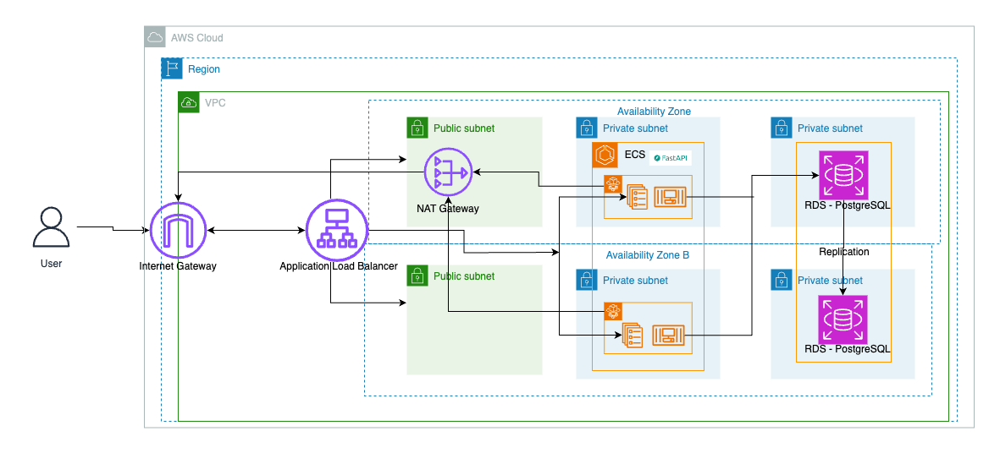

# Architecture Overview

This project follows a three-tier architecture design using AWS services to ensure security, scalability, and availability. The architecture is implemented using ECS Fargate for the application tier, Amazon RDS for the database layer, and an Application Load Balancer (ALB) in the public subnet to provide a DMZ-like network setup.

## Key Components
1. Virtual Private Cloud (VPC):

- The entire architecture is hosted within a dedicated VPC that logically isolates the application infrastructure.
- The VPC is divided into public and private subnets across multiple Availability Zones for high availability.

2. Public Subnet (DMZ/Perimeter Network):

- Internet Gateway (IGW): The IGW provides internet access to resources within the public subnets.
- Application Load Balancer (ALB): The ALB is deployed in the public subnets and handles incoming traffic from the internet, distributing it to the ECS Fargate tasks running in private subnets. It provides a single entry point to the application while offloading SSL and managing HTTP/HTTPS traffic.
- NAT Gateway: The NAT Gateway is used to provide outbound internet access to ECS Fargate tasks hosted in private subnets. This allows them to pull images from Amazon ECR or communicate with other external services without exposing them to the public internet.

3. Private Subnet (Application Layer):

- ECS Fargate: The core application logic runs on ECS Fargate tasks, which are hosted in private subnets across two availability zones. ECS Fargate allows us to run containers without managing servers, ensuring scalability and cost-efficiency.
- These tasks are not directly exposed to the internet and only receive traffic routed through the ALB.

4. Private Subnet (Database Layer):

- Amazon RDS (PostgreSQL): The data layer is hosted on Amazon RDS PostgreSQL in private subnets. It is replicated across availability zones to ensure high availability and durability. The database is only accessible by the ECS Fargate tasks in the application layer, ensuring its security.
- The database is isolated from the public internet and accessible only through the internal network.

## Data Flow

1. User Access: Users access the application through the Application Load Balancer (ALB), which is publicly accessible via the Internet Gateway.
2. Application Logic: The ALB forwards requests to the ECS Fargate tasks in the private subnets, where the business logic is processed.
3. Data Access: The ECS Fargate tasks communicate with the Amazon RDS database in the private subnets to store and retrieve data.
4. Outbound Access: The ECS Fargate tasks use the NAT Gateway for outbound access to pull Docker images from Amazon ECR or other external services.